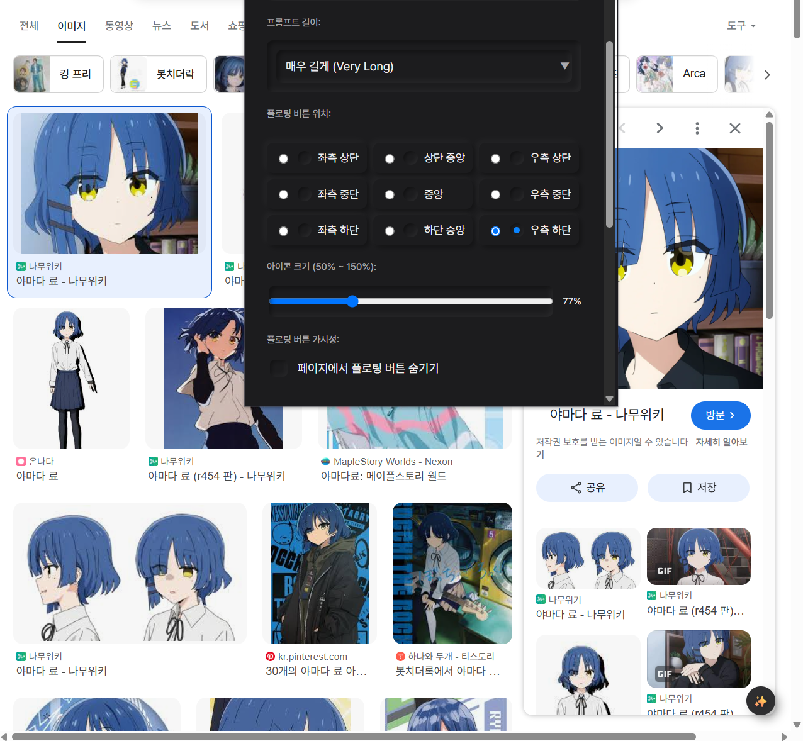
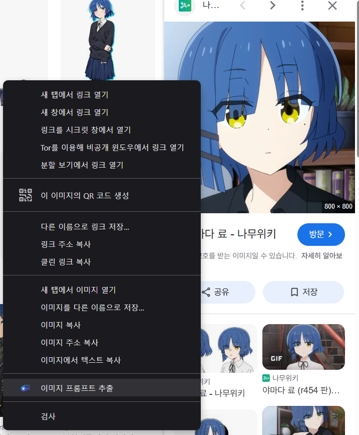
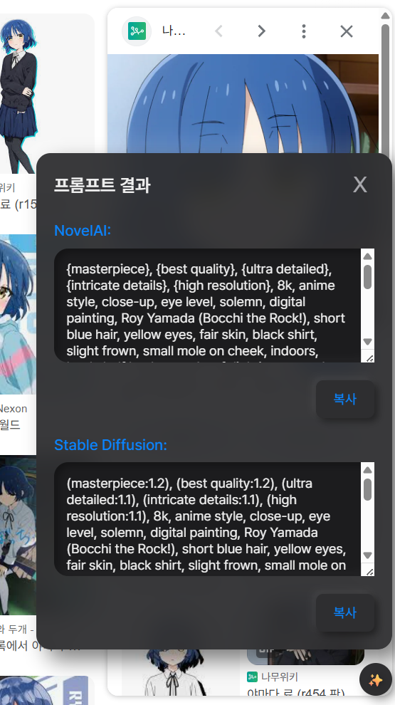

## Imprompt
> Image + Prompt

{: width="40%"}
{: width="50%"}

**소개:**

본 확장 프로그램은 웹페이지 상의 이미지로부터 텍스트를 추출하고, 추출된 텍스트를 기반으로 다양한 AI 모델에 최적화된 프롬프트를 생성하는 기능을 합니다.

**주요 기능:**

* **AI 프롬프트 생성:** 추출된 텍스트를 분석하여 NovelAI, Stable Diffusion 등에서 사용할 수 있는 AI 이미지 생성 모델에 적합한 프롬프트를 자동으로 생성합니다.

**사용법:**

1.  **이미지 선택:** 프롬프트를 생성하고자 하는 웹페이지에서 이미지를 마우스 오른쪽 버튼으로 클릭합니다.
2.  **컨텍스트 메뉴:** 나타나는 컨텍스트 메뉴에서 "이미지 프롬프트 추출" 항목을 선택합니다.
3.  **프롬프트 확인:** 팝업 창이 나타나 이미지에서 추출된 텍스트와 생성된 AI 프롬프트를 보여줍니다.
4.  **프롬프트 복사:** "복사" 버튼을 클릭하여 생성된 프롬프트를 클립보드에 복사합니다.
5.  **AI 도구 적용:** 복사된 프롬프트를 NovelAI, Stable Diffusion 등 원하는 AI 이미지 생성 도구에 붙여넣어 이미지를 생성합니다.

**확장 프로그램 적용법:**

1.  **파일 다운로드:** 제공된 확장 프로그램 파일들을 로컬 디스크에 저장합니다.
2.  **크롬 확장 프로그램 페이지 접속:** Chrome 브라우저의 주소창에 `chrome://extensions/`를 입력하고 Enter 키를 누릅니다.
3.  **개발자 모드 활성화:** 페이지 우측 상단에 있는 "개발자 모드" 스위치를 켭니다.
4.  **압축 해제된 확장 프로그램 로드:** 좌측 상단에 있는 "압축 해제된 확장 프로그램 로드" 버튼을 클릭하고, 다운로드한 확장 프로그램 파일들이 저장된 폴더를 선택합니다.
5.  **확장 프로그램 활성화 확인:** "이미지 프롬프트 추출기" 확장 프로그램이 활성화되어 있는지 확인합니다. 아이콘이 툴바에 표시될 것입니다.